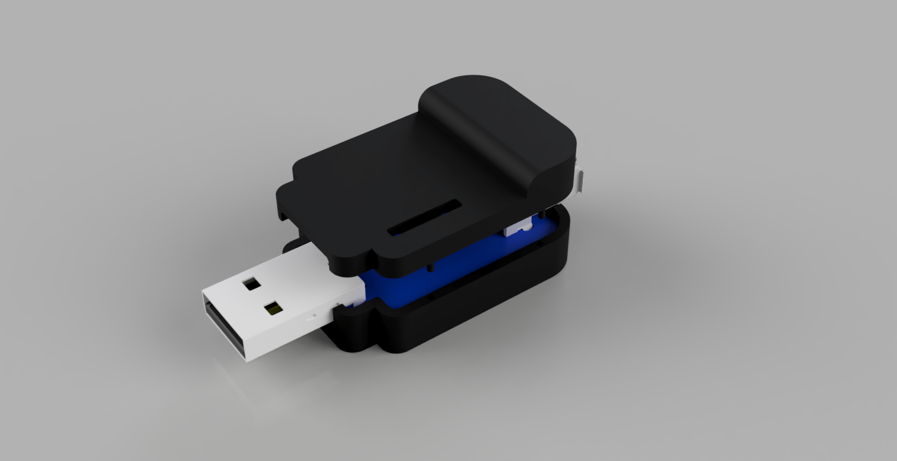
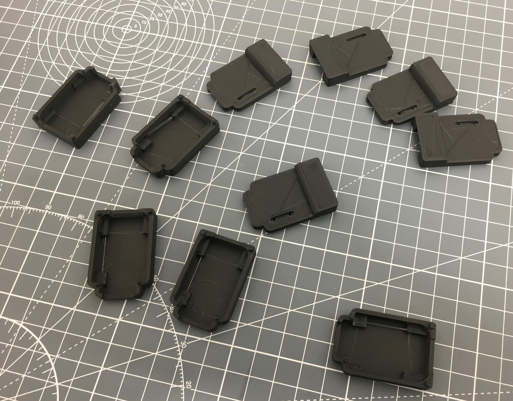

# 3D Printed Case for TMK USB-USB converter

Created in Autodesk Fusion 360.

### Notes for printing

There is a very small peice connecting the 2 halves of the shells together, this is so it is recognised as a single print.  It should be small enough enough that it is ignored, but if it is flagged by your print software or 3rd party printer you can tell them to disregard it.

